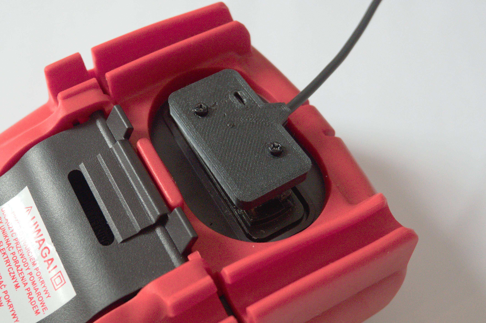
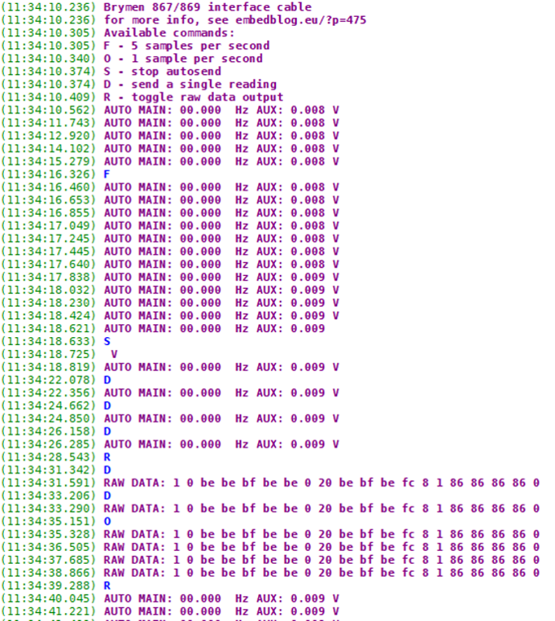

# Outdated - see the new revision [here](https://github.com/MartinD-CZ/brymen-867-869-interface-cable-rev20)!

# Brymen 867/869 adapter cable
*see the article [here](http://embedblog.eu/?p=475) or the listing [here](https://www.tindie.com/products/martind/brymen-867869-adapter-cable/)*

## Features
- reads data from Brymen 867/869(s) via infrared
- sends the measurements at 9600 baud via virtual serial port
- output data rate and format adjustable
- activity LED
- you **need **a 3D printed case to use this

*Here's how the finished adapter looks:*

*Here's how the serial output looks:*

*If you are ordering it without the USB cable (or want to reprogram it), here's the connection diagram:*

 
